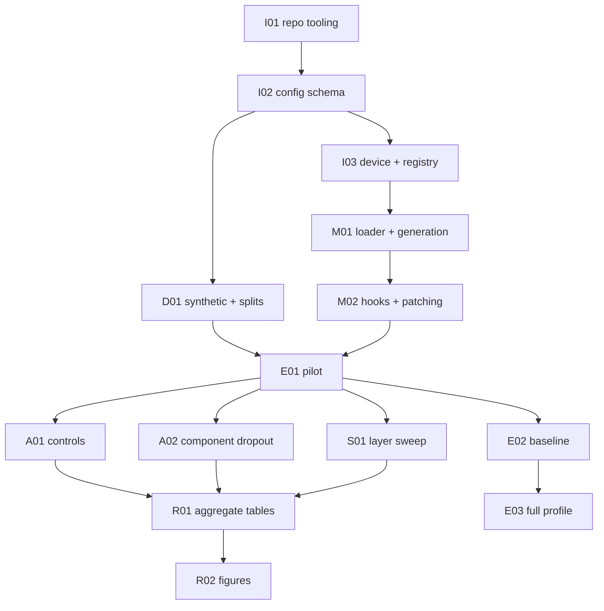

# TASK.md — Control Protocols Outside Lab-Clean Environments

ID convention: `I##` infrastructure, `D##` data, `M##` modelling / hooks,
`E##` experiments, `A##` ablations, `S##` sweeps, `R##` reporting.

## Dependency DAG

## Index

| ID | Issue | Category | Title | Priority | Complexity | Est. days | Refs |
|---|---|---|---|---|---|---:|---|
| I01 | — | infra | Makefile, CI, locks | P0 | S | 1 | X2,X3,X10 |
| I02 | — | infra | Typed Hydra schema + presets | P0 | M | 2 | §3 |
| I03 | — | infra | Device + MPS fallback | P0 | S | 1 | X4,X13 |
| I04 | — | infra | Layer validation | P0 | S | 0.5 | X8,X11 |
| D01 | — | data | Synthetic builders + manifests | P0 | M | 1 | X11 |
| M01 | — | model | Pinned load + chat template | P0 | M | 2 | X5,X9 |
| M02 | — | model | Attention + activation patching | P0 | M | 2 | X7 |
| E00 | — | exp | Config smoke | P0 | S | 0.5 | — |
| E01 | — | exp | Pilot end-to-end | P0 | L | 3 | X1 |
| E02 | — | exp | Baseline | P1 | L | 3 | — |
| E03 | — | exp | Full profile | P2 | L | 3 | — |
| E04 | — | exp | Harness validation | P0 | M | 2 | — |
| A01 | — | abl | Control arms | P1 | M | 1 | — |
| A02 | — | abl | Component dropout | P1 | M | 1 | — |
| A03 | — | abl | Seed sweep | P1 | S | 1 | — |
| S01 | — | sweep | Layers | P1 | M | 1 | — |
| S02 | — | sweep | Scale | P2 | M | 1 | — |
| R01 | — | report | Aggregate MD/TeX | P0 | M | 1 | — |
| R02 | — | report | Figures + captions | P1 | M | 1 | — |
| X12 | — | metrics | MDE + TOST | P0 | S | 1 | X12 |

## Task details

### I01 — Repo tooling
| Field | Value |
|---|---|
| Priority | P0 |
| Complexity | S |
| Depends on | — |

**Description.** Emit Makefile with interpreter discovery, exact requirement
pins, CI jobs (lint/test/api-contract/typecheck/coverage), pre-commit.

**Steps.**
1. Candidate-list Python 3.12 discovery
2. `requirements.txt` + `requirements.lock` with `==` pins
3. Five CI jobs on Python 3.12

**Acceptance criteria.**
- `make doctor` and `make ci` run on a clean clone
- No hardcoded single absolute Python path

### I02 — Config schema
| Field | Value |
|---|---|
| Priority | P0 |
| Complexity | M |

**Description.** Nested dataclasses, role-keyed models, programmatic
`load_config`, presets including real `base_experiment`.

**Acceptance criteria.**
- Test composes every experiment preset
- `Config.roles` accepts multiple `ModelConfig` values

### I03 — Device layer
**Acceptance criteria.** MPS sets fallback env var; `mps_fallback_enabled` in
manifest; CUDA-missing raises.

### D01 — Data spine
**Acceptance criteria.** `n_items>=512` pilot; split indices recorded; manifests
round-trip.

### M01 — Load + generation
**Acceptance criteria.** Revision pinned; resolved commit recorded; chat
template path recorded.

### M02 — Hooks
**Acceptance criteria.** `patch_activations` and `intervene_attention_heads`
covered by unit tests on tiny GPT-2.

### E01 — Pilot
**Acceptance criteria.** `make pilot` runs without `NotImplementedError` once
domain stages are registered; smoke passes before domain work.

### A01 / A02 / A03 — Ablations
**Acceptance criteria.** Each module returns structured dicts; tests assert keys.

### R01 / R02 — Reporting
**Acceptance criteria.** Aggregate emits MD + TeX; figures write PDF/SVG/PNG +
caption.

### X12 — Equivalence
**Acceptance criteria.** CI spanning zero alone never labelled as null; MDE
present; TOST API tested.

## Notes

Domain-specific tasks beyond this shared index live in each repo's issue tracker
and must reference the binding fixes in `docs/REQUIRED_FIXES.md` of the
meta-repo when relevant.

### Backlog hygiene

Move finished IDs to GitHub issues with the same ID in the title.

### Backlog hygiene

Move finished IDs to GitHub issues with the same ID in the title.

### Backlog hygiene

Move finished IDs to GitHub issues with the same ID in the title.

### Backlog hygiene

Move finished IDs to GitHub issues with the same ID in the title.

### Backlog hygiene

Move finished IDs to GitHub issues with the same ID in the title.

### Backlog hygiene

Move finished IDs to GitHub issues with the same ID in the title.

### Backlog hygiene

Move finished IDs to GitHub issues with the same ID in the title.

### Backlog hygiene

Move finished IDs to GitHub issues with the same ID in the title.

### Backlog hygiene

Move finished IDs to GitHub issues with the same ID in the title.

### Backlog hygiene

Move finished IDs to GitHub issues with the same ID in the title.

### Backlog hygiene

Move finished IDs to GitHub issues with the same ID in the title.

### Backlog hygiene

Move finished IDs to GitHub issues with the same ID in the title.

### Backlog hygiene

Move finished IDs to GitHub issues with the same ID in the title.

### Backlog hygiene

Move finished IDs to GitHub issues with the same ID in the title.

### Backlog hygiene

Move finished IDs to GitHub issues with the same ID in the title.
